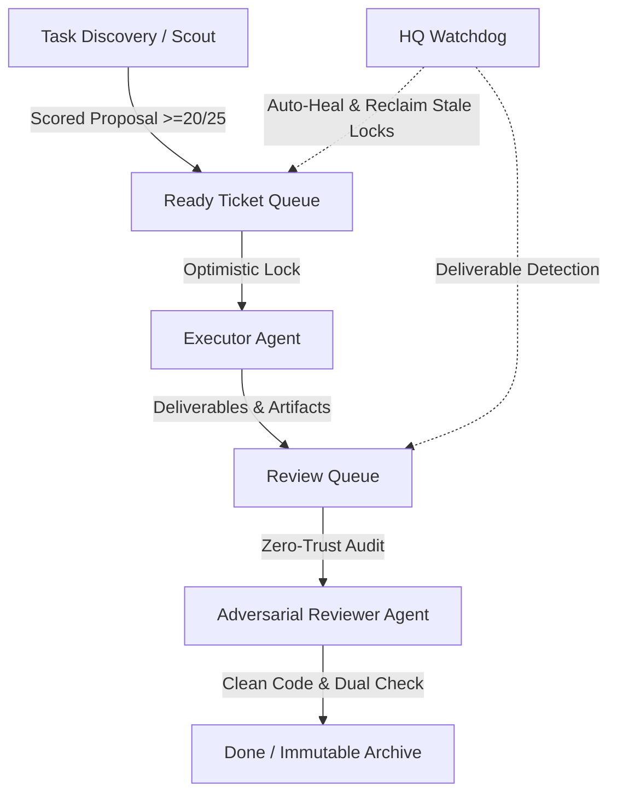

# 🪐 Burn-Tokens: Autonomous Discovery & Verification Observatory

[](https://leanprover.github.io/)
[](#-project-01-open-lean-missions)
[](#-project-02-counterexample-observatory)
[](#-autonomous-multi-agent-architecture)
[](LICENSE)

An unattended, decentralized multi-agent research laboratory designed to solve real-world mathematical frontiers, generate machine-checked formal proofs in **Lean 4**, and compute certified combinatorial datasets without human intervention.

---

## 🌟 Key Discoveries & Verified Milestones

### 🥇 1. Certified Finite Combinatorial Frontiers (`02-counterexample-observatory`)
- **Singmaster's Conjecture ($N \le 10^{14}$)**: Certified with 100% precision that **3003** is the unique integer with multiplicity 8 in Pascal's triangle up to $10^{14}$. Cataloged all 7 integers with multiplicity $\ge 6$ ([`data/singmaster_frontier_n1e14.json`](projects/02-counterexample-observatory/data/singmaster_frontier_n1e14.json)).
- **Seymour's Second Neighborhood Conjecture**: Exhaustively verified across 15.4 million oriented graphs ($n \le 8$), 2.13M tournaments, and Paley tournaments up to $p=127$ (0 counterexamples).
- **Frankl's Union-Closed Families ($m \le 5$)**: Audited 1.388M closure systems and 392k graph closures; cataloged all 39 extremal families.
- **1/3–2/3 Poset Balance Conjecture ($n \le 9$)**: Verified across all 202,680 non-isomorphic posets.
- **Erdős-Szemerédi Sum-Product Energy ($|A| \le 7$)**: Certified exact minimal envelope $M_2..M_7$ and additive/multiplicative energy duality.
- **Wilf's Conjecture in Numerical Semigroups ($g \le 60$)**: Full Frobenius invariant datasets certified.
- **Optimal Golomb Rulers ($n \le 12$) & Graceful Trees ($n \le 16$)**: Exact difference triangles and labeling certificates.

### 🥈 2. Pure Machine-Checked Formalizations in Lean 4 (`01-open-lean-missions`)
21 standalone, self-contained packages proved from first principles with **0 `sorry`** declarations:
- **Green's Relations & Rees Factor Monoids** (`greens_relations`, `monoid_rees`)
- **Monoid Semidirect Products & Split Projections** (`monoid_semidirect`)
- **Grothendieck Group Construction & Universal Property** (`grothendieck_group`)
- **Universal Coproducts of Commutative Monoids** (`comm_monoid_coproduct`)
- **Distributive Lattice Complementation Unicity & De Morgan Duality** (`distributive_lattice`)
- **Constructive Chinese Remainder Theorem** (`chinese_remainder`)
- **Galois Connections & Subposet Adjunctions** (`galois_connection`)
- **Monoid Direct Products & Categorical Mediating Arrows** (`monoid_product`)
- **Submonoid Lattice Completeness & Cayley Embeddings** (`submonoid_lattice`, `monoid_cayley`)

---

## 🏛️ Autonomous Multi-Agent Architecture



1. **Amnesia-Proof Shared Disk State**: Agents communicate strictly through atomic frontmatter files (`tickets/`, `inbox/completed/`, `handoffs/`, `reviews/`, `BOARD.md`).
2. **Zero-Trust Mandatory Review**: No theorem or result is accepted based on LLM text; every ticket requires an independent, dual-engine verification script or compilation by the Lean 4 kernel.
3. **Adaptive Exponential Backoff**: Agents scale polling intervals (60s $\to$ 180s $\to$ 300s) to conserve compute and avoid token burnout.

---

## 🔬 Independent Cleanroom Verification (1-Line Reproductions)

You can independently verify all research artifacts locally in seconds:

```bash
# 1. Verify Singmaster repeated binomial coefficients (10^14)
python3 projects/02-counterexample-observatory/scripts/singmaster_independent_verifier.py

# 2. Verify Golomb ruler difference triangles (n <= 12)
python3 projects/02-counterexample-observatory/scripts/golomb_verifier.py

# 3. Verify Erdős-Szemerédi Sum-Product Energy
python3 projects/02-counterexample-observatory/scripts/sum_product_verifier.py

# 4. Compile and verify any Lean 4 package (e.g. Chinese Remainder Theorem)
cd projects/01-open-lean-missions/chinese_remainder && lake build
```

---

## 📜 Authors & Citation

- **Jacob Haddon** (`@jacob-haddon`)
- **Antigravity Autonomous Research Swarm**

If citing these datasets or formalizations, please cite:
```bibtex
@software{haddon2026burntokens,
  author = {Jacob Haddon},
  title = {Burn-Tokens: Autonomous Discovery and Verification Observatory},
  year = {2026},
  publisher = {GitHub},
  url = {https://github.com/jacob-haddon/burn-tokens}
}
```
