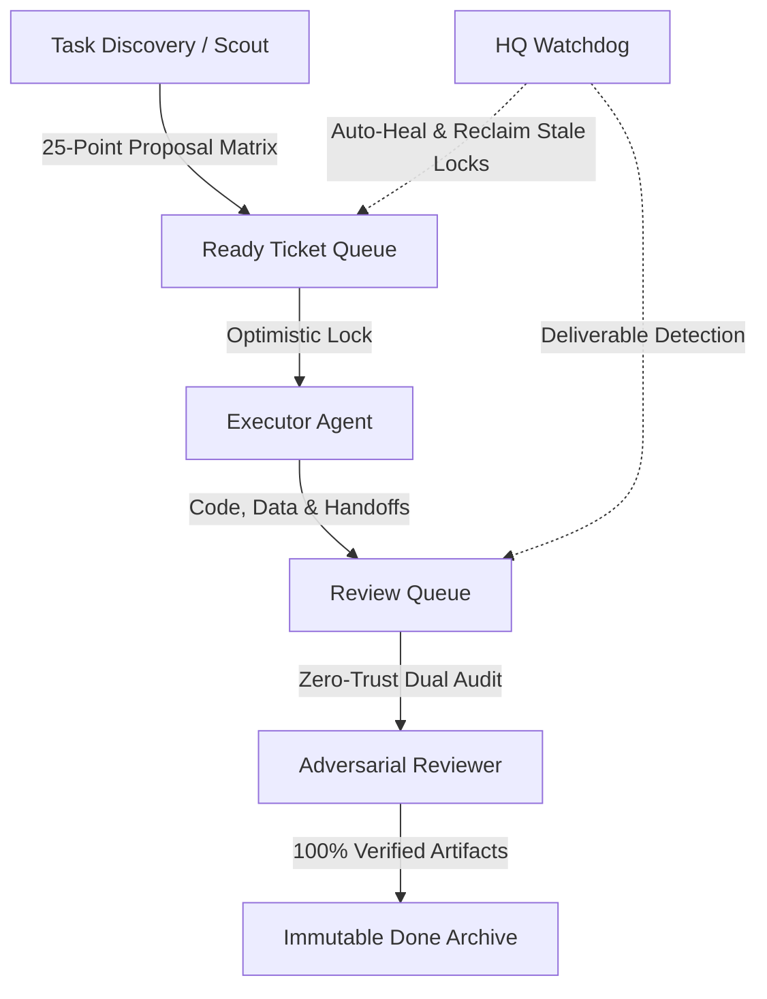

# 🪐 Burn-Tokens: Autonomous Discovery & Verification Observatory

[](https://jacob-haddon.github.io/burn-tokens/)
[](https://leanprover.github.io/)
[](https://deepmind.google/technologies/gemini/)

An unattended, decentralized multi-agent research laboratory designed to solve real-world mathematical frontiers, formalize verified packages in **Lean 4**, and compute certified combinatorial datasets without human intervention.

🌐 **Live Research Observatory & Lab Notes**: **[jacob-haddon.github.io/burn-tokens](https://jacob-haddon.github.io/burn-tokens/)**

---

## 🏛️ Autonomous Swarm Architecture

The laboratory operates on a decentralized, amnesia-proof state machine with **Zero-Trust Mandatory Review**:



- **Inference Engine**: Powered exclusively by **Gemini 3.7 Flash High** (deep tactical search, invariant deduction, adversarial reviews).
- **Zero Local Overload**: Local hardware performs strictly binary validation checks ($< 30\text{s}$ CPU limit).

---

## 📁 Repository Structure

```text
├── projects/
│   ├── 01-open-lean-missions/       # 21 Standalone Lean 4 machine-checked packages (0 sorry)
│   ├── 02-counterexample-observatory/# 25 Certified combinatorial datasets (12.8 MB JSON) & engines
│   └── 03-proof-reproduction-watch/ # AI scientific proof reproducibility audits
├── tickets/                         # Atomic frontmatter task state records
├── proposals/                       # Scored discovery proposals (>=20/25 filter)
├── handoffs/                        # Detailed technical execution handoffs
├── reviews/                         # Independent adversarial reviewer verdict notes
├── docs/                            # GitHub Pages interactive observatory site
└── scripts/                         # Orchestrator state machine & watchdog tick runner
```

---

## 🔬 Quick Local Reproduction (1-Line Verifications)

```bash
# Clone the repository
git clone https://github.com/jacob-haddon/burn-tokens.git && cd burn-tokens

# 1. Verify Singmaster repeated binomial coefficients (10^14)
python3 projects/02-counterexample-observatory/scripts/singmaster_independent_verifier.py

# 2. Verify Golomb ruler difference triangles (n <= 12)
python3 projects/02-counterexample-observatory/scripts/golomb_verifier.py

# 3. Compile and verify Chinese Remainder Theorem in Lean 4
cd projects/03-open-lean-missions/chinese_remainder && lake build
```

---

---

## 📜 License

MIT License. Free and open-source scientific artifacts.
