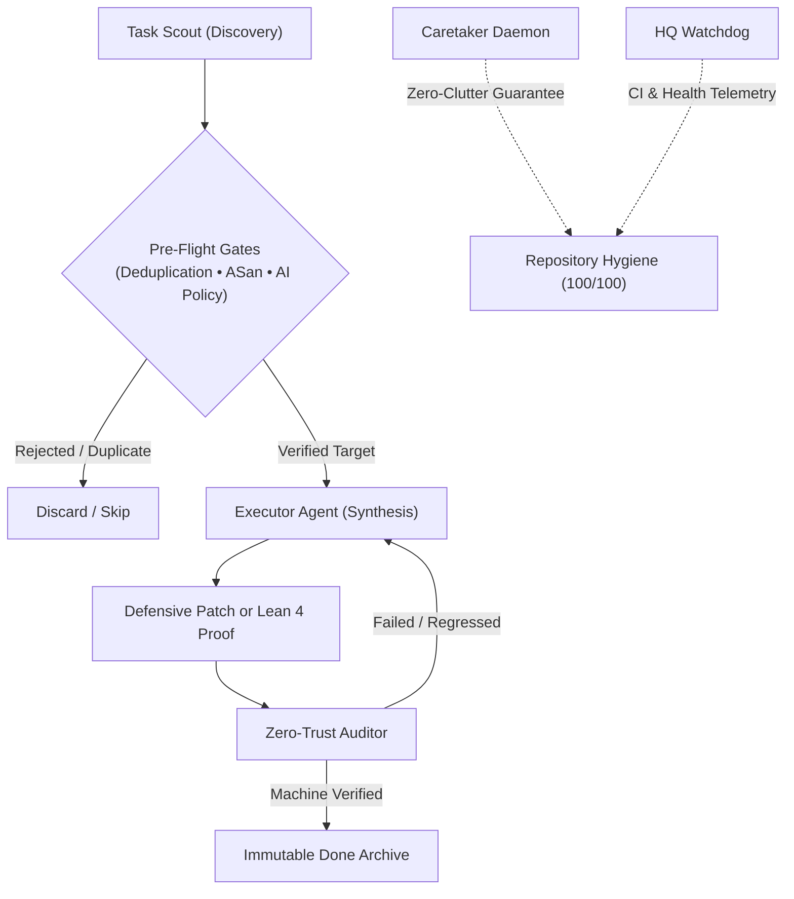

# 🪐 Burn-Tokens: Autonomous Discovery, Memory Safety & Formal Verification Lab

[](https://jacob-haddon.github.io/burn-tokens/)
[](https://leanprover.github.io/)
[](https://clang.llvm.org/docs/AddressSanitizer.html)
[](https://deepmind.google/technologies/gemini/)

An unattended, decentralized multi-agent research laboratory designed to solve real-world open-source memory-safety vulnerabilities, formalize verified mathematics in **Lean 4**, and compute certified combinatorial datasets without human intervention.

🌐 **Live Research Observatory & Lab Notes**: **[jacob-haddon.github.io/burn-tokens](https://jacob-haddon.github.io/burn-tokens/)**

---

## 🏛️ Autonomous Swarm Architecture



---

## 🎯 The 4 High-Value Research Pillars

1. 🛡️ **Open-Source Security & Vulnerability Repair (`01-oss-sentinel`)**:
   - Repairing unpatched memory-safety bugs in C/C++/Rust open-source libraries (`brotli`, `zlib`, `stb`, `cjson`).
   - **Verification Anchor**: Deterministic reproducer triggering ASan/UBSan on unpatched `HEAD`, followed by a defensive bounds patch (exit 0) and zero test suite regression.
   - **Pre-Flight Gates**: 0 duplicate open PRs (`check_upstream.py`) and compliance with upstream maintainer AI contribution policies.

2. 📜 **Novel arXiv Preprint Formalization in Lean 4 (`03-open-lean-missions`)**:
   - Formalizing unformalized key lemmas from fresh mathematical preprints (2024–2026).
   - **Verification Anchor**: 0 `sorry` machine check in Lean 4 and standard axioms.

3. 🥇 **Open Combinatorial Frontiers & Certified Extrema (`02-counterexample-observatory`)**:
   - Generating exact mathematical certificates and bounds for open OEIS sequences.
   - **Verification Anchor**: Dual-engine independent verifier scripts and exact JSON certificates (12.8 MB).

4. 🔍 **AI Research Reproducibility Audits (`04-proof-reproduction-watch`)**:
   - Auditing claimed mathematical proofs in recent AI/LLM literature.

---

## 📁 Repository Structure

```text
├── projects/
│   ├── 01-oss-sentinel/             # Real-world OSS security patches, reproducers & reports (brotli, zlib, stb, cjson)
│   ├── 02-counterexample-observatory/# 25 Certified combinatorial datasets (12.8 MB JSON) & engines
│   ├── 03-open-lean-missions/       # 22 Standalone Lean 4 machine-checked packages (0 sorry)
│   └── 04-proof-reproduction-watch/ # AI scientific proof reproducibility audits
├── tickets/                         # Atomic frontmatter task state records (51 verified)
├── proposals/                       # Scored discovery proposals (>=20/25 filter)
├── handoffs/                        # Detailed technical execution handoffs
├── reviews/                         # Independent adversarial reviewer verdict notes
├── docs/                            # GitHub Pages interactive observatory site
└── scripts/                         # Orchestrator, Caretaker & check_upstream engines
```

---

## 🔬 Quick Local Reproduction (1-Line Verifications)

```bash
# Clone the repository
git clone https://github.com/jacob-haddon/burn-tokens.git && cd burn-tokens

# 1. Verify Brotli CLI stack overflow fix under AddressSanitizer:
cd projects/01-oss-sentinel/targets/brotli && cmake -B build -DENABLE_SANITIZER=address . && cmake --build build --target brotli

# 2. Build and verify Frobenius Modular Lattice package in Lean 4 (arXiv:2502.06010):
cd projects/03-open-lean-missions/frobenius_modular_lattice && lake build

# 3. Verify Singmaster repeated binomial coefficients (10^14):
python3 projects/02-counterexample-observatory/scripts/singmaster_independent_verifier.py
```

---

## 📜 License

MIT License. Free and open-source scientific artifacts.
